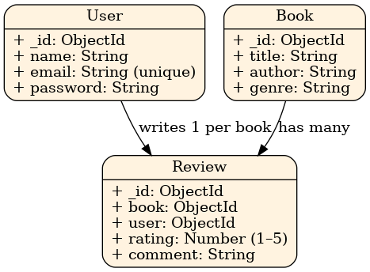

# 🗂️ Database Schema - Book Review API

## 🧑‍💻 User Model

```js
{
  _id: ObjectId,
  name: String,
  email: String, // unique
  password: String (hashed),
}
```

## 📚 Book Model

```js
{
  _id: ObjectId,
  title: String,
  author: String,
  genre: String,
}
```

## ✍️ Review Model

```js
{
  _id: ObjectId,
  book: ObjectId, // reference to Book
  user: ObjectId, // reference to User
  rating: Number (1–5),
  comment: String,
  createdAt: Date,
  updatedAt: Date
}
```

---

## 🔗 Relationships

- A **User** can submit **one review per book**
- A **Book** can have **many reviews**
- A **Review** belongs to **one User** and **one Book**

---

## 🖼️ ER Diagram


